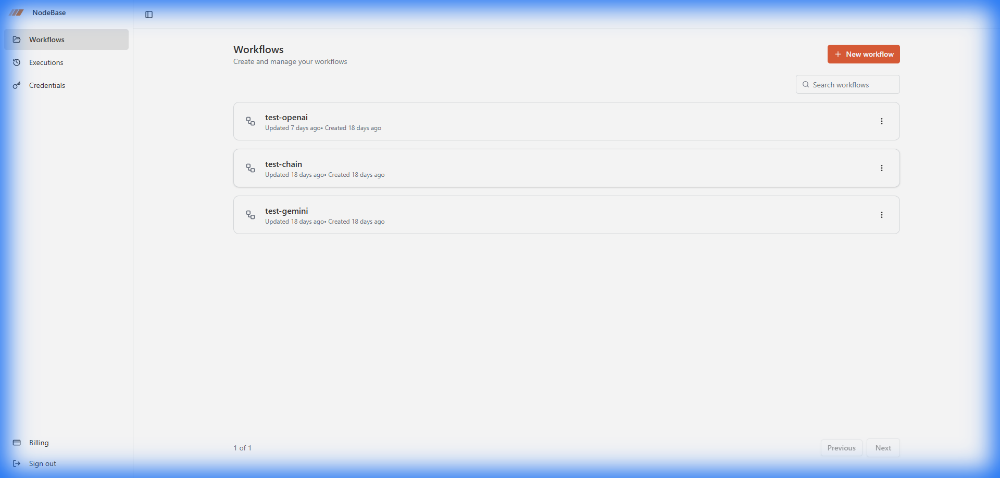
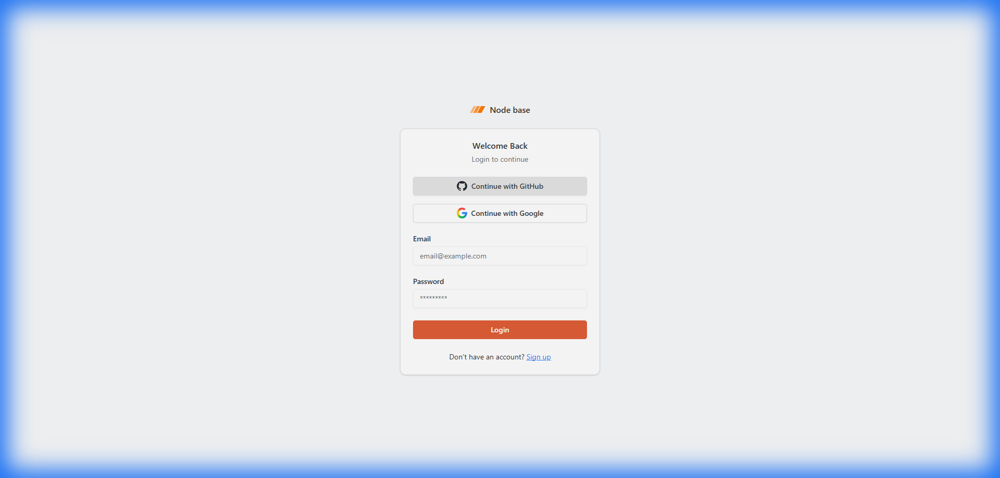
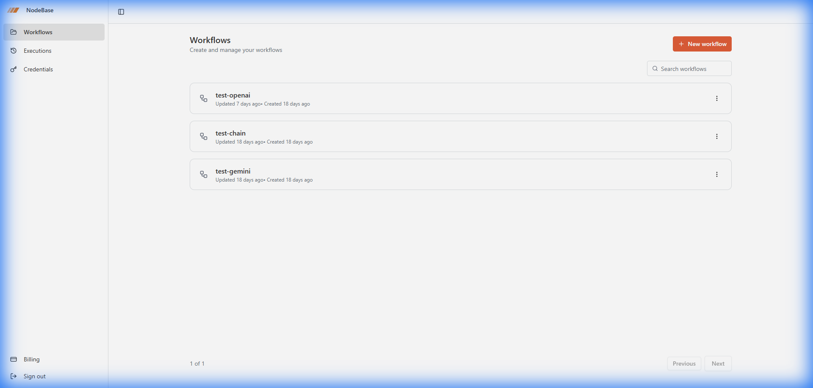
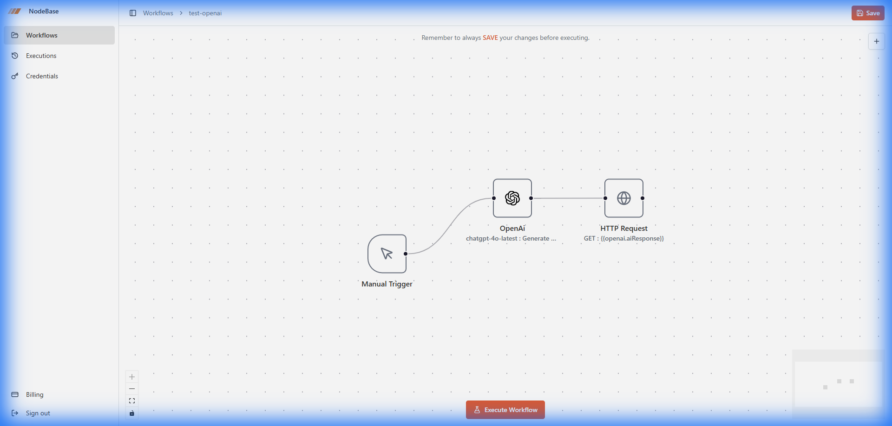
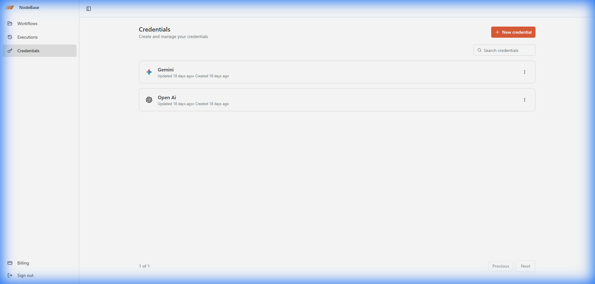

<div align="center">

# 🌊 NodeBase Workflow

**A high-performance, visual automation platform for building seamless integrations.**

[](https://nodebase-workflow.vercel.app/)
[](https://opensource.org/licenses/MIT)
[](https://nextjs.org/)
[](https://www.typescriptlang.org/)

</div>

---

[](https://nodebase-workflow.vercel.app/)

## 🚀 Overview

NodeBase Workflow is a powerful, visual automation platform designed to help you streamline tasks and integrate various services with ease. Built with modern web technologies, it offers a seamless and intuitive experience for building complex workflows without writing code.

Whether you're looking to automate repetitive tasks, connect APIs, or build sophisticated logic flows, NodeBase Workflow provides the tools you need in a drag-and-drop interface.

## 📸 Screenshots Gallery

| Landing & Login | Workflows Dashboard |
| :---: | :---: |
| [](https://nodebase-workflow.vercel.app/) | [](https://nodebase-workflow.vercel.app/workflows) |
| *Modern Authentication & Entry Point* | *Centralized Workflow Management* |

| Workflow Editor | Credentials Management |
| :---: | :---: |
| [](https://nodebase-workflow.vercel.app/workflows) | [](https://nodebase-workflow.vercel.app/credentials) |
| *Intuitive Drag-and-Drop Node Builder* | *Secure API Keys & Credentials* |

<details>
<summary><b>🔍 Feature Highlights & Insights</b></summary>

- **Visual Workflow Builder**: Powered by React Flow (XYFlow) for a smooth node-based experience.
- **Dynamic Variable Passing**: Use Handlebars templates to pass data between nodes.
- **Real-time Monitoring**: Integrated with Inngest for reliable, event-driven execution with live status updates.
- **Multi-Provider AI**: One-click integration with OpenAI, Anthropic, and Google Gemini.

</details>

## ✨ Key Features

1.  **Visual Workflow Builder** - Drag-and-drop interface powered by **XYFlow** for creating complex automation workflows.
2.  **Multi-Trigger Support** - Start workflows with **Manual**, **Google Forms**, or **Stripe Webhooks**.
3.  **AI Integration** - Seamlessly connect to **OpenAI**, **Anthropic**, and **Google Gemini** models.
4.  **HTTP Request Node** - Make external API calls with custom headers and dynamic variable interpolation.
5.  **Real-time Monitoring** - Track execution status, detailed logs, and history in real-time.
6.  **Secure Credentials** - Encrypted storage for API keys with per-user isolation.
7.  **Auth & Billing** - Complete system powered by **Better Auth** and **Polar.sh** for subscriptions.

## 🛠️ Tech Stack

### Core & Framework
- **Next.js 16** (App Router) & **React 19**
- **TypeScript 5**
- **Tailwind CSS 4** & **Shadcn UI**

### Infrastructure & Workflow
- **PostgreSQL** & **Prisma 6**
- **Inngest** (Workflow Engine)
- **React Flow (XYFlow)**
- **Better Auth** & **Polar.sh**

### AI & API
- **Vercel AI SDK** (OpenAI, Anthropic, Google)
- **tRPC** & **React Query**
- **Zod 4** (Validation)

## 💻 Getting Started

### Prerequisites
- Node.js 20+
- PostgreSQL database
- Inngest account

### Installation

1.  **Clone & Install:**
    ```bash
    git clone https://github.com/TpMarkov/nodebase.git
    cd nodebase
    npm install
    ```

2.  **Local Environment:**
    ```bash
    cp .env.example .env
    # Fill in your DATABASE_URL, BETTER_AUTH_SECRET, etc.
    ```

3.  **Database & Dev:**
    ```bash
    npx prisma migrate dev
    npm run dev
    ```

4.  **Inngest Server:**
    ```bash
    npm run inngest
    ```

## 📝 License

This project is licensed under the MIT License.

## 🤝 Contributing & Support

Contributions are welcome! Please open an issue or submit a pull request. 
For questions, feel free to contact [TpMarkov](https://github.com/TpMarkov).

